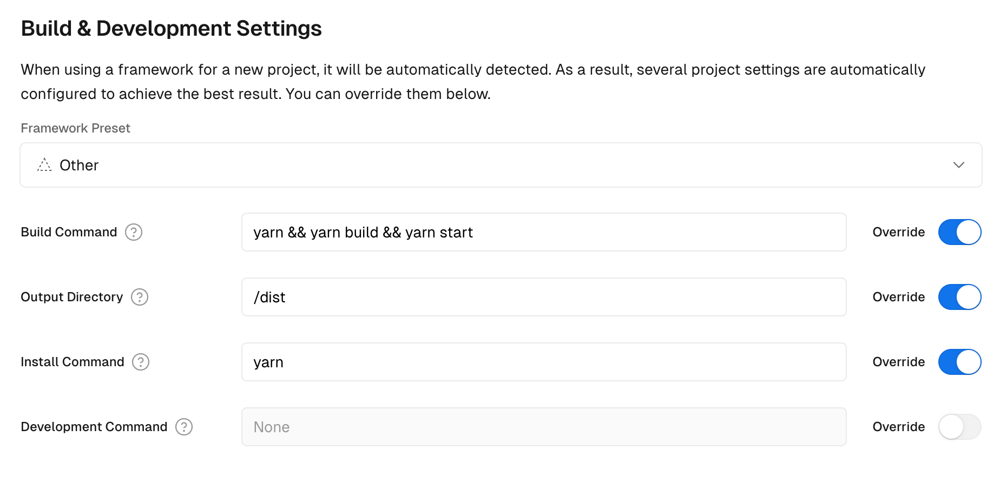

# Reminding on the last day of the month

Telegram bot for reminding on the last day of the month

## Use

1. Create and fill `.env` with `TELEGRAM_BOT_TOKEN`, `TELEGRAM_CHAT_ID`, `TELEGRAM_BOT_MESSAGE` and `CRON_RULE`
2. Run `yarn build` and `yarn start`

#### Where:

- `TELEGRAM_BOT_MESSAGE` is a message from a bot to you
- `CRON_RULE` must be in format `"0 10 * * *"` for reciving message at `10 a.m.`. Check time on your server. `versel.com` has GMT-0 (UTC+00:00)

## Project Structure

- `src`: Source files
- `dist`: Build files

## Setup

```
yarn start
```

## Build

```
yarn build
```

## versel.com Build & Development Settings


